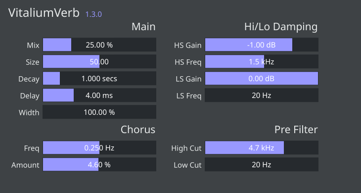

# VitaliumVerb



A [Rust](https://www.rust-lang.org/) port of the reverb module from the [Vital](https://github.com/mtytel/vital)/[Vitalium] synthesizer, allowing it to be used as an effect plugin. There are also a few minor improvements and optimizations added:
* A stereo width parameter applied to the wet signal
* Tweaked parameter curves that focus better on the sweet spots
* Runtime-evaluated constants like filter coefficients, gain amplitudes, chorus phase increments, and allpass matrices are only recalculated when their respective parameters have changed (the original recalculated these every process cycle).

> Made using the awesome [NIH-plug](https://github.com/robbert-vdh/nih-plug) plugin development framework.

## Download

You can download pre-built binaries for Linux, Windows, and MacOS from the [Releases](https://github.com/BillyDM/vitalium-verb/releases) tab.

Installation instructions are included in the zip files.

## Building from source

After installing [Rust](https://www.rust-lang.org/learn/get-started) and the [nightly toolchain](https://rust-lang.github.io/rustup/concepts/channels.html) (`rustup toolchain install nightly`), you can compile VitaliumVerb as follows:

```shell
cargo +nightly xtask bundle vitalium_verb --release
```

Then copy `/target/bundled/VitaliumVerb.clap` and/or `/target/bundled/VitaliumVerb.vst3` to the corresponding plugin directories for your OS.

On macOS you may need to [disable Gatekeeper](https://disable-gatekeeper.github.io/) as Apple has recently made it more difficult to run unsigned code on macOS.

[Vitalium]: https://github.com/DISTRHO/DISTRHO-Ports/tree/5c55f9445ee6ff75d53c7f8601fc341d200aa4a0/ports-juce6.0/vitalium

## Technical Reading

For those interested in my experience porting this plugin to Rust, I wrote a blogpost titled [Porting a Reverb](https://billydm.github.io/blog/porting-a-reverb/).
